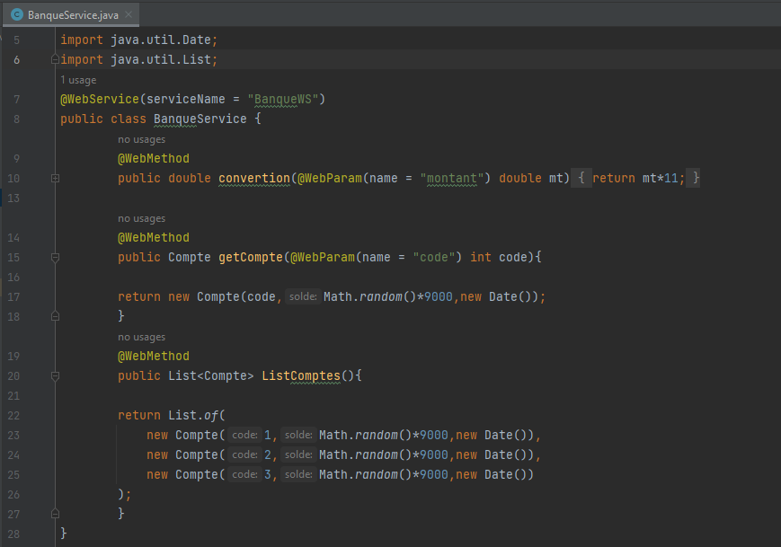
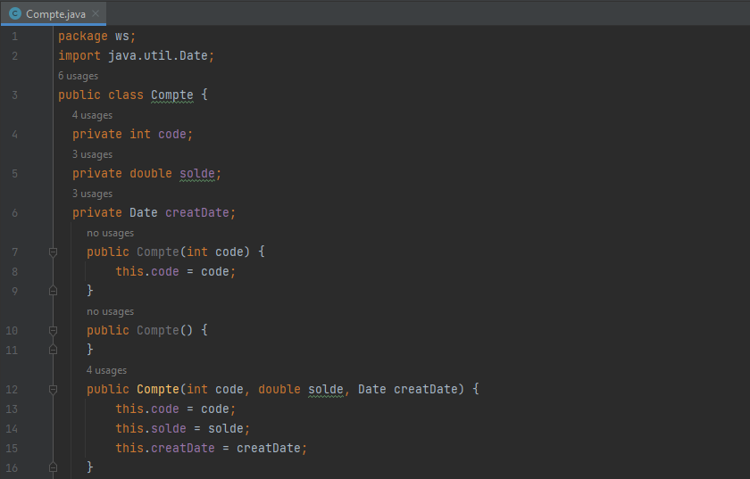
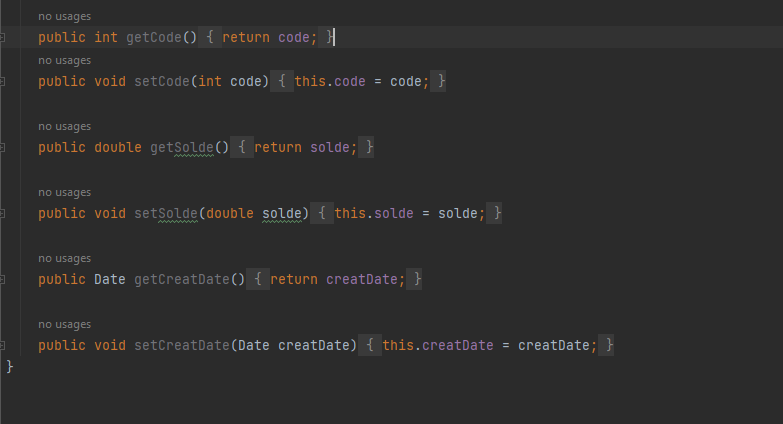
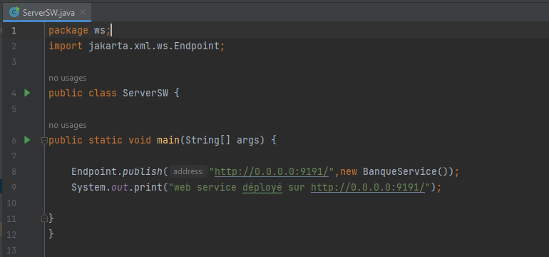
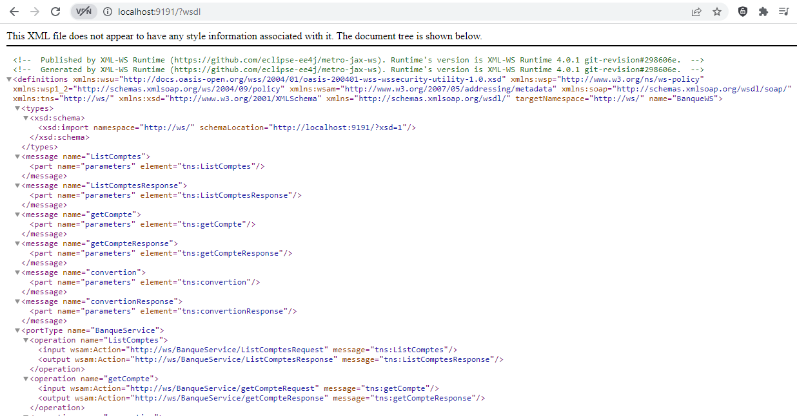
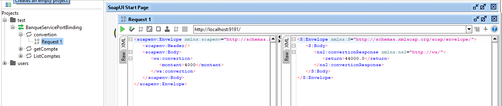
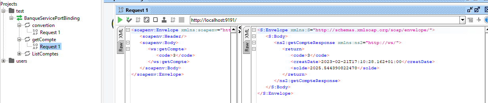
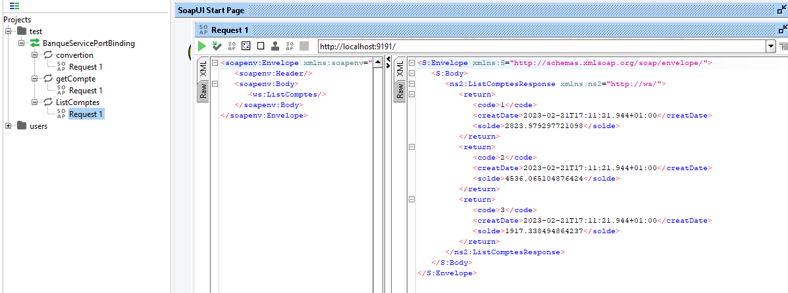

<h2 style="text-align:center;color:powderblue">Compte Rendu</h2>
<ol>
  <li>Créer un Web service:
    
    
    
  </li>
  <li>Déployer le Web service avec un simple Serveur JaxWS:
    
  </li>
  <li>Consulter et analyser le WSDL avec un Browser HTTP:
    
  </li>
  <li>Tester les opérations du web service avec un outil
comme SoapUI:
   
    
    

  </li>
</ol>

